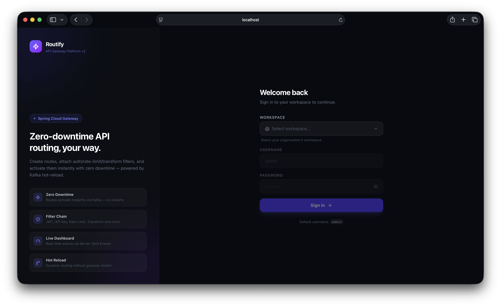
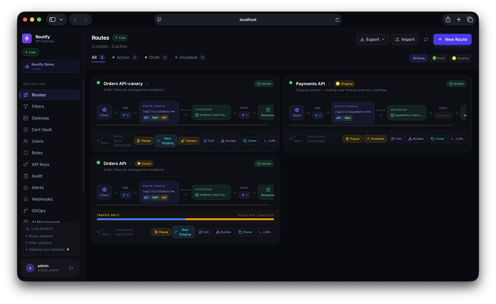
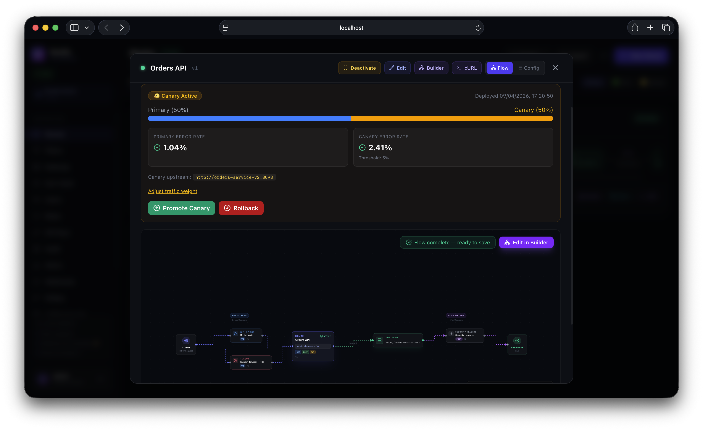
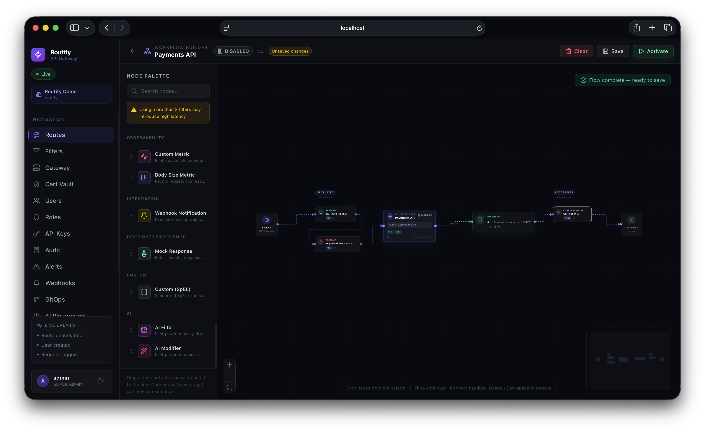
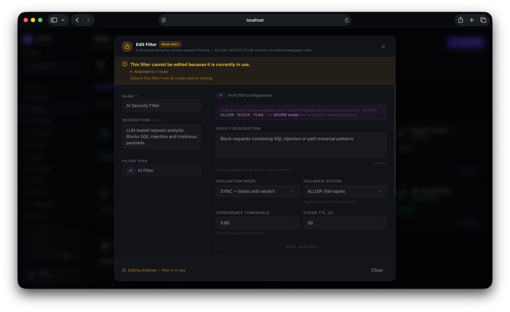
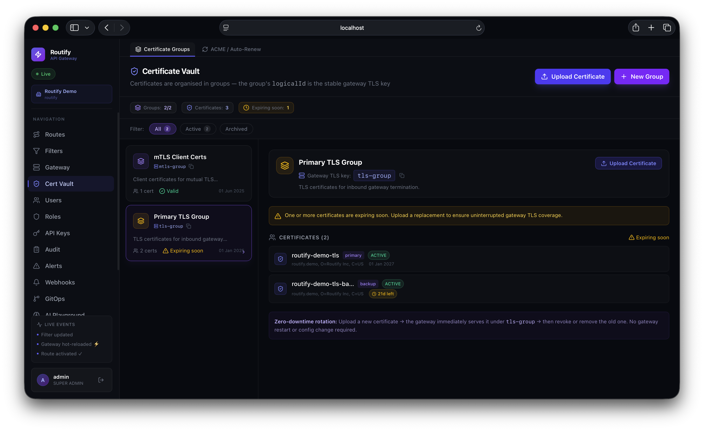
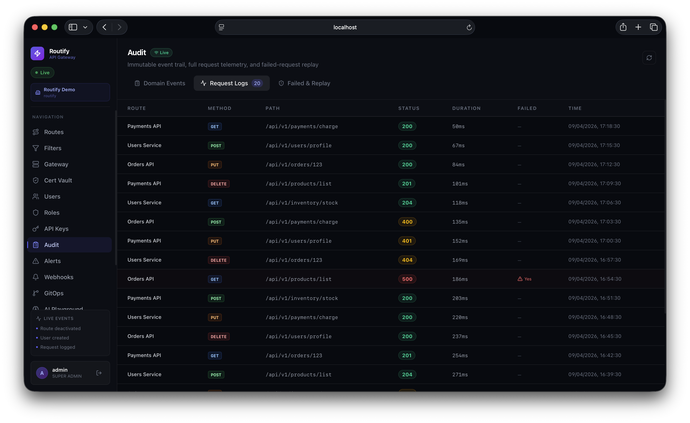
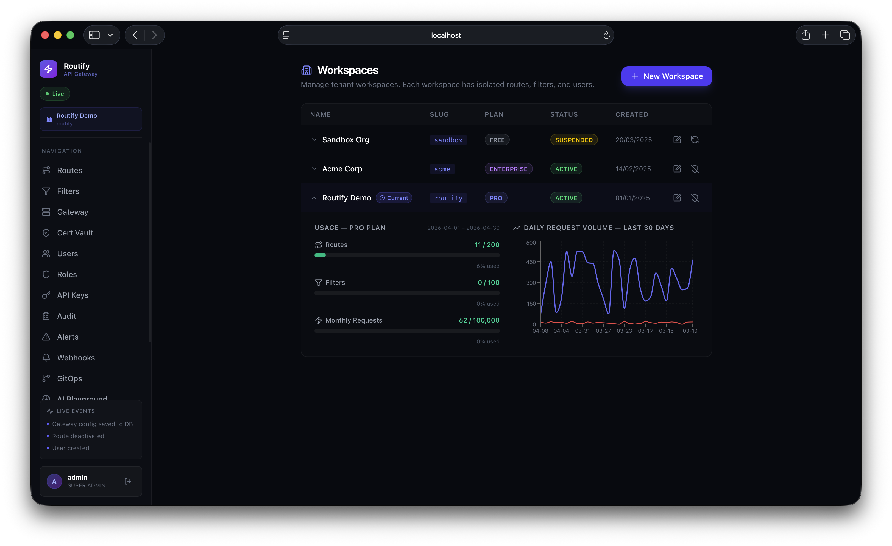

<h1 align="center">Routify</h1>

<p align="center">
  <strong>Multi-tenant, zero-downtime API Gateway Platform</strong>
</p>

<p align="center">
  
  
  
  
  
</p>

<p align="center">
  <a href="#-features">Features</a> •
  <a href="#-demo--screenshots">Demo</a> •
  <a href="#-architecture">Architecture</a> •
  <a href="#-getting-started">Getting Started</a> •
  <a href="#-repository-structure">Structure</a> •
  <a href="#-testing">Testing</a> •
  <a href="#-deployment">Deployment</a>
</p>

---

## 📖 Overview

Routify is a **production-grade API Gateway platform** that lets teams dynamically configure, monitor, and secure API routes — all through a real-time React dashboard with **zero downtime** on configuration changes.

Unlike traditional gateways that rely on static YAML files and redeployments, Routify treats routes as **first-class, database-backed resources** that are hot-reloaded into a Spring Cloud Gateway runtime via event-driven messaging. Every change propagates instantly across all gateway instances without restarts.

### The Problem

- API route changes typically require YAML edits, code reviews, and full redeployments
- No unified visibility across tenants, certificates, audit trails, and AI-powered security
- Certificate management, rate limiting, and circuit breakers are fragmented across tools

### The Solution

Routify provides a **single pane of glass** for the entire API lifecycle:

- **Dynamic routing** — create, update, activate, and delete routes from the dashboard; changes propagate to all gateway instances in real time
- **Multi-tenancy** — full tenant isolation with per-tenant quotas, RBAC, and API key management
- **AI-powered security** — LLM-driven request filtering and modification via Spring AI + OpenAI
- **TLS certificate vault** — upload, auto-renew (ACME/Let's Encrypt), and rotate certificates with AES-256 encrypted storage
- **Full audit trail** — every configuration change and API request is logged, queryable, and replayable
- **GitOps** — reconcile gateway config from a Git repository for infrastructure-as-code workflows

---

## ✨ Features

| Category | Capabilities |
|---|---|
| **Gateway** | Dynamic route loading, path/method matching, request/response filters, header manipulation, URL rewriting, strip-prefix, canary deployments (weighted traffic splitting) |
| **Security** | JWT RS256 authentication, API key auth, OAuth2 token injection, RBAC with custom roles & permissions, rate limiting (Redis-backed), circuit breakers (Resilience4j) |
| **AI Filters** | LLM-powered request filtering (block/allow/flag), request body modification, deterministic verdict caching (Redis), configurable fallback actions |
| **Certificates** | Upload PEM/PKCS12 certs, ACME auto-issuance (Let's Encrypt), auto-renewal scheduling, certificate groups, gateway TLS mapping, AES-256 encrypted storage |
| **Observability** | Distributed tracing (OpenTelemetry → Tempo), Prometheus metrics, Grafana dashboards, structured JSON logging with correlation IDs |
| **Audit** | Immutable audit log, request telemetry, DLQ event persistence, request replay, time-series analytics (GraphQL), configurable retention policies |
| **Multi-Tenancy** | Tenant isolation, plan-based quotas (FREE/STARTER/BUSINESS/ENTERPRISE), workspace switching, per-tenant usage tracking |
| **GitOps** | Git-based route config reconciliation, dry-run preview, webhook notifications, SSH/HTTPS auth |
| **Dashboard** | Real-time route management, visual workflow builder, analytics charts, certificate expiry monitoring, AI decision inspection, alert configuration |

---

## 🖼 Demo & Screenshots



### Dashboard Overview


*The main dashboard showing route health, request metrics, and system status at a glance.*

### Route Management


*Create, edit, and manage API routes with real-time status indicators and filter attachments.*

### Routing View & Workflow Builder


*Visual workflow builder showing the request flow through filters, transformations, and upstream targets.*

### AI Filter Analytics


*AI filter decision breakdown — allow/block/flag rates, latency percentiles, and cache hit ratios.*

### Certificate Vault


*TLS certificate lifecycle management with ACME auto-renewal status and expiry monitoring.*

### Audit Trail


*Immutable audit log with full-text search, filtering by event type, and request replay capability.*

### Workspaces


*Manage tenant workspaces with usage Plans*

---

## 🏗 Architecture

Routify follows a **microservices architecture** with **event-driven communication**. Services never call each other via HTTP — all inter-service communication uses **Apache Kafka** (async commands & domain events) and **RabbitMQ** (sync request/reply queries).

```
                    ┌──────────────────┐
      Internet ────►│   API Gateway    │ :8080  (Spring Cloud Gateway)
                    └────────┬─────────┘
                             │ Kafka + RabbitMQ
                             │
┌───────────┐    ┌───────────┼───────────┐    ┌─────────────┐
│ Dashboard  │───►│     Admin API       │    │  AI Service  │
│ (React)   │    │  (BFF — REST/GQL/WS) │    │ (Spring AI)  │
│    :3000   │    │       :8082          │    │    :8086     │
└───────────┘    └───────────┬───────────┘    └─────────────┘
                   ┌─────────┼─────────┐
             ┌─────┤         │         ├─────┐
         ┌───┴───┐ ┌───┴───┐ ┌───┴───┐ ┌───┴───┐ ┌────────┐
         │ Ident.│ │ Route │ │ Cert  │ │ Audit │ │ GitOps │
         │  Svc  │ │  Svc  │ │ Vault │ │  Svc  │ │ Agent  │
         │ :8083 │ │ :8081 │ │ :8085 │ │ :8084 │ │ :8087  │
         └───────┘ └───────┘ └───────┘ └───────┘ └────────┘
              │         │         │         │
         ┌────┴─────────┴─────────┴─────────┘
         ▼
  ┌────────────┐  ┌───────┐  ┌───────┐  ┌──────────┐
  │ PostgreSQL │  │ Redis │  │ Kafka │  │ RabbitMQ │
  │    :5432   │  │ :6379 │  │ :9092 │  │   :5672  │
  └────────────┘  └───────┘  └───────┘  └──────────┘
```

### Services

| Service | Port | Mgmt Port | Description |
|---|---|---|---|
| [`routify-api-gateway`](./routify-api-gateway/) | 8080 | 9080 | Spring Cloud Gateway — dynamic route loading, AI filters, TLS termination, rate limiting, circuit breakers. **No database.** |
| [`routify-admin-api`](./routify-admin-api/) | 8082 | 9082 | BFF for the dashboard. REST + GraphQL + WebSocket/SSE. Proxies all commands via Kafka and queries via RabbitMQ. |
| [`routify-identity-service`](./routify-identity-service/) | 8083 | 9083 | Authentication (JWT RS256), users, tenants, API keys, RBAC, webhooks. **Only service with the JWT private key.** |
| [`routify-route-service`](./routify-route-service/) | 8081 | 9081 | Route & filter CRUD, gateway config persistence, transactional outbox event publishing. |
| [`routify-audit-service`](./routify-audit-service/) | 8084 | 9084 | Event consumer — audit log, request telemetry, DLQ persistence, AI decision tracking, alert engine, request replay. |
| [`routify-cert-vault`](./routify-cert-vault/) | 8085 | 9085 | TLS certificate lifecycle — upload, ACME issuance, auto-renewal, gateway TLS mapping. AES-256 encrypted storage. |
| [`routify-ai-service`](./routify-ai-service/) | 8086 | 9086 | AI-powered request filtering/modification via Spring AI + OpenAI. Stateless — no database. |
| [`routify-gitops-agent`](./routify-gitops-agent/) | 8087 | 9087 | Git-based route config reconciliation (pull from repo → push to admin-api). |
| [`routify-dashboard`](./routify-dashboard/) | 3000 | — | React 19 + TypeScript + Vite + TailwindCSS 4 + TanStack Query + Zustand. |
| [`routify-common`](./routify-common/) | — | — | Shared library — domain enums, sealed event types, Kafka/RabbitMQ topology, `@Sensitive` encryption, RPC base class. |

### Communication Patterns

| Pattern | Technology | Use Case |
|---|---|---|
| **Async commands** | Apache Kafka | Dashboard → Admin API → owning service (e.g., create route, update user) |
| **Domain events** | Apache Kafka | Service → gateway/audit (e.g., `RouteCreated`, `CertificateUploaded`) |
| **Sync queries** | RabbitMQ (Direct Reply-To) | Admin API → owning service for reads (e.g., list routes, get stats) |
| **Real-time updates** | WebSocket / SSE | Admin API → Dashboard (live route status, audit events) |

### Data Flow Example: Creating a Route

```
Dashboard ──REST──► Admin API ──Kafka──► Route Service
                                              │
                                    ┌─────────┤ (same DB transaction)
                                    ▼         ▼
                               Route table   Outbox table
                                              │
                                    ┌─────────┤ (OutboxPoller)
                                    ▼         ▼
                              Kafka topic   RouteCreated event
                                    │
                         ┌──────────┼──────────┐
                         ▼                     ▼
                    API Gateway          Audit Service
                  (hot-reload)         (persist to log)
```

### Database Architecture

Single PostgreSQL 17 instance with **schema-per-service** isolation:

| Schema | Owner Service | Content |
|---|---|---|
| `routify` | route-service | Routes, filters, outbox events, gateway config |
| `routify_identity` | identity-service | Users, tenants, roles, API keys, webhooks |
| `routify_audit` | audit-service | Audit events, request logs, DLQ events, AI decisions, alerts |
| `routify_cert` | cert-vault | Certificates, ACME orders, cert groups |
| `routify_ops` | (shared) | Cross-schema monitoring views and procedures |

---

## 🚀 Getting Started

### Prerequisites

| Tool | Version | Purpose |
|---|---|---|
| **Java** | 25+ | Backend services |
| **Maven** | 3.9+ | Build system |
| **Docker** & **Docker Compose** | 27+ / v2 | Infrastructure & containerised services |
| **Node.js** | 22+ | Dashboard development |
| **npm** | 10+ | Dashboard dependencies |

### 1. Clone the Repository

```bash
git clone https://github.com/your-org/routify.git
cd routify
```

### 2. Generate Environment Variables

Run the **"Generate .env"** GitHub Actions workflow, or copy the pre-generated file:

```bash
cp environments/.env.develop .env
```

> **Required variables:** `DB_PASS`, `RABBITMQ_PASS`, `REDIS_PASS`, `JWT_PRIVATE_KEY`, `JWT_PUBLIC_KEY`, `FIELD_ENCRYPTION_KEY`, `CERT_VAULT_ENCRYPTION_KEY`, `OPENAI_API_KEY`
>
> See [`environments/README.md`](./environments/README.md) for the full variable reference.

### 3. Start Infrastructure

```bash
docker compose --env-file .env up -d
```

This starts: **PostgreSQL 17**, **Redis 7**, **Apache Kafka 3.9**, **RabbitMQ 3.13**, **Grafana Tempo**, **Prometheus**, and **Grafana**.

Verify all containers are healthy:

```bash
docker compose ps
```

### 4. Build All Java Modules

```bash
mvn clean package -DskipTests
```

### 5. Start Application Services

**Option A: Docker Compose (all services)**

```bash
docker compose -f docker-compose.yml -f docker-compose.app.yml up -d
```

**Option B: Run individually from your IDE**

All IntelliJ `.run/*.run.xml` configurations automatically load `environments/.env.develop` — just click Run.

For manual startup, each service is a standard Spring Boot app:

```bash
cd routify-route-service
mvn spring-boot:run
```

### 6. Start the Dashboard

```bash
cd routify-dashboard
npm install
npm run dev          # → http://localhost:3000
```

For development without backend services:

```bash
npm run dev:mock     # Uses MSW (Mock Service Worker) handlers
```

### 7. Access the Platform

| Component | URL |
|---|---|
| **Dashboard** | [http://localhost:3000](http://localhost:3000) |
| **API Gateway** | [http://localhost:8080](http://localhost:8080) |
| **Admin API (REST)** | [http://localhost:8082/api/v1/admin/](http://localhost:8082/api/v1/admin/) |
| **GraphiQL Playground** | [http://localhost:8082/api/v1/admin/graphiql](http://localhost:8082/api/v1/admin/graphiql) (requires `dev` profile) |
| **RabbitMQ Management** | [http://localhost:15672](http://localhost:15672) (routify / `$RABBITMQ_PASS`) |
| **Grafana** | [http://localhost:3001](http://localhost:3001) (admin / `$GRAFANA_PASSWORD`) |
| **Prometheus** | [http://localhost:9091](http://localhost:9091) |

> **First login:** The identity-service seeds an admin user on first boot. If `ADMIN_INITIAL_PASSWORD` is set in your `.env`, use that. Otherwise, a random password is printed to the identity-service stdout **once** — check the logs with `docker logs routify-identity`.

---

## 📁 Repository Structure

```
routify/
├── routify-common/                 # Shared library (events, DTOs, encryption, RPC base)
├── routify-identity-service/       # Auth, users, tenants, API keys, RBAC
├── routify-route-service/          # Routes, filters, gateway config, outbox
├── routify-api-gateway/            # Spring Cloud Gateway runtime
├── routify-admin-api/              # BFF — REST + GraphQL + WebSocket/SSE
├── routify-audit-service/          # Audit log, telemetry, DLQ, alerts, replay
├── routify-cert-vault/             # TLS certificates, ACME, encrypted storage
├── routify-ai-service/             # AI request filtering (Spring AI + OpenAI)
├── routify-gitops-agent/           # Git-based config reconciliation
├── routify-dashboard/              # React 19 SPA (Vite + TailwindCSS 4)
│   ├── src/
│   │   ├── modules/                # Feature modules (routes, filters, certs, audit, ai, …)
│   │   ├── store/                  # Zustand state stores
│   │   ├── hooks/                  # TanStack Query hooks
│   │   ├── api/                    # Axios API client layer
│   │   ├── mocks/                  # MSW v2 request handlers
│   │   └── components/             # Shared UI components
│   └── e2e/                        # Playwright E2E tests
├── docker/
│   ├── postgres/
│   │   ├── init.sql                # Schema creation (5 schemas)
│   │   └── ops_monitoring.sql      # Cross-schema monitoring views
│   ├── kafka/                      # Kafka production checklist
│   ├── prometheus/                 # Prometheus config & alert rules
│   ├── grafana/provisioning/       # Grafana datasource provisioning
│   └── tempo/                      # Tempo (distributed tracing) config
├── deploy/helm/routify/            # Production Helm chart
├── environments/                   # Branch-scoped .env files
├── scripts/                        # Utility scripts (Flyway validate, Helm smoke tests)
├── docs/                           # Documentation, CLI examples, export schema
├── docker-compose.yml              # Infrastructure services
├── docker-compose.app.yml          # Application services
├── docker-compose.ci.yml           # CI override (pre-built JARs)
└── pom.xml                         # Parent Maven POM (BOM)
```

---

## 🧪 Testing

### Backend (Java)

```bash
# Unit tests (Surefire — *Test.java)
mvn test

# Integration tests (Failsafe — *IT.java) — uses Testcontainers
mvn verify -DskipITs=false

# Quick build (skip all tests)
mvn clean package -DskipTests
```

> **Note:** Integration tests are disabled by default (`<skipITs>true</skipITs>`) due to Docker Engine 29.x / Testcontainers compatibility. Each service's `*IntegrationBase.java` starts PostgreSQL + Kafka + RabbitMQ containers via the Testcontainers singleton pattern.

### Dashboard (TypeScript)

```bash
cd routify-dashboard

# Unit tests (Vitest + happy-dom)
npm test

# Unit tests (CI mode — single run)
npm run test:ci

# E2E tests (Playwright)
npm run test:e2e

# E2E tests (interactive UI mode)
npm run test:e2e:ui

# Lint + format check
npm run lint
```

---

## 🏭 Deployment

### Docker Compose (Development / Staging)

```bash
# Full stack
cp environments/.env.develop .env
mvn clean package -DskipTests
docker compose -f docker-compose.yml -f docker-compose.app.yml up -d --build
```

### Docker Compose with Pre-built JARs (CI)

```bash
mvn clean package -DskipTests
docker compose -f docker-compose.yml -f docker-compose.app.yml -f docker-compose.ci.yml build
docker compose -f docker-compose.yml -f docker-compose.app.yml -f docker-compose.ci.yml up -d
```

### Kubernetes (Production)

A production-ready Helm chart is provided in [`deploy/helm/routify/`](./deploy/helm/routify/):

```bash
# Create secrets
kubectl create secret generic routify-platform-secrets \
  --from-literal=db-password=<password> \
  --from-literal=rabbitmq-password=<password> \
  --from-literal=redis-password=<password> \
  --from-literal=jwt-private-key="$(cat jwt-private.pem)" \
  --from-literal=jwt-public-key="$(cat jwt-public.pem)" \
  --from-literal=cert-vault-encryption-key=<key> \
  --from-literal=openai-api-key=sk-<key>

# Install
helm install routify deploy/helm/routify/

# Production values (external managed services)
helm install routify deploy/helm/routify/ \
  -f deploy/helm/routify/values-production.yaml \
  --set secrets.existingSecret=routify-platform-secrets
```

See [`deploy/helm/routify/README.md`](./deploy/helm/routify/README.md) for the full values reference.

---

## 🔧 Tech Stack

### Backend

| Technology | Version | Purpose |
|---|---|---|
| Java | 25 | Language (sealed types, records, pattern matching, virtual threads) |
| Spring Boot | 4.0.5 | Application framework |
| Spring Cloud Gateway | 2025.1.1 | API Gateway runtime |
| Spring AI | 2.0.0-M4 | LLM integration (OpenAI) |
| Apache Kafka | 3.9 | Async commands & domain events |
| RabbitMQ | 3.13 | Synchronous RPC (Direct Reply-To) |
| PostgreSQL | 17 | Persistent storage (schema-per-service) |
| Redis | 7 | Caching, rate limiting, session state |
| Resilience4j | 2.2 | Circuit breakers & time limiters |
| Flyway | — | Database migrations |
| MapStruct | 1.6.3 | Object mapping |
| Lombok | 1.18.44 | Boilerplate reduction |
| jjwt | 0.13.0 | JWT creation & validation |
| Micrometer + OpenTelemetry | — | Metrics & distributed tracing |
| Testcontainers | 2.0.4 | Integration testing |

### Frontend

| Technology | Version | Purpose |
|---|---|---|
| React | 19 | UI framework |
| TypeScript | 6.0 | Type safety |
| Vite | 8.0 | Build tool & dev server |
| TailwindCSS | 4 | Styling |
| TanStack Query | 5 | Server state management |
| Zustand | 5 | Client state management |
| React Hook Form + Zod | 7 / 4 | Form management & validation |
| React Router | 7 | Client-side routing |
| Recharts | 3 | Data visualisation |
| MSW | 2 | API mocking (dev + tests) |
| Playwright | 1.59 | E2E testing |
| Vitest | 4.1 | Unit testing |

### Observability

| Tool | Port | Purpose |
|---|---|---|
| Grafana Tempo | 3200 | Distributed trace storage |
| Prometheus | 9091 | Metrics collection |
| Grafana | 3001 | Dashboards & visualisation |

---

## 🌍 Environment Variables

All secrets are managed via `.env` files. See [`environments/README.md`](./environments/README.md) for full details.

| Variable | Required By | Description |
|---|---|---|
| `DB_PASS` | identity, route, audit, cert-vault | PostgreSQL password |
| `RABBITMQ_PASS` | All Java services | RabbitMQ password |
| `REDIS_PASS` | All Java services | Redis password |
| `JWT_PRIVATE_KEY` | identity-service only | RSA-2048 private key (PKCS8, DER, base64) |
| `JWT_PUBLIC_KEY` | All Java services | RSA-2048 public key (SPKI, DER, base64) |
| `FIELD_ENCRYPTION_KEY` | identity, route, audit, cert-vault | AES-256 key for `@Sensitive` field encryption |
| `CERT_VAULT_ENCRYPTION_KEY` | cert-vault | AES-256 key for certificate material encryption |
| `OPENAI_API_KEY` | ai-service | OpenAI API key for AI-powered filtering |
| `ADMIN_INITIAL_PASSWORD` | identity-service | Initial admin user password (optional) |
| `GRAFANA_PASSWORD` | grafana | Grafana admin password |

---

## 📚 Additional Documentation

| Document | Description |
|---|---|
| [`environments/README.md`](./environments/README.md) | Environment variable reference & `.env` file generation |
| [`deploy/helm/routify/README.md`](./deploy/helm/routify/README.md) | Helm chart values reference & Kubernetes deployment guide |
| [`docs/kubernetes-deployment.md`](./docs/kubernetes-deployment.md) | Kubernetes deployment architecture |
| [`docs/release-process.md`](./docs/release-process.md) | Release workflow & versioning |
| [`docs/cli-examples.md`](./docs/cli-examples.md) | CLI command examples for common operations |
| [`docs/schema/route-export-v1.yaml`](./docs/schema/route-export-v1.yaml) | Route export/import YAML schema definition |
| [`AGENTS.md`](./AGENTS.md) | AI coding agent conventions & codebase guide |

---

## 🤝 Contributing

1. Create a feature branch from `develop`: `git checkout -b feature/my-feature develop`
2. Make your changes and ensure all tests pass
3. Submit a pull request targeting `develop`

### Development Conventions

- **Flyway migrations:** `V<N>__<description>.sql` in each service's `src/main/resources/db/migration/`
- **Hibernate DDL:** `validate` only — never use `create` or `update`
- **Events:** Add new domain events to `DomainEvent.java` (record + `permits` + `@JsonSubTypes.Type`)
- **Mappers:** Use `@Mapper(componentModel = "spring")` — see `RouteMapper.java` for examples
- **Logging:** Include `correlationId`, `tenantId`, `userId` in MDC
- **Secrets:** Declare `routify.required-secrets` in `application.yml` — startup fails if any are blank

---

<p align="center">
  Built with ☕ and ❤️
</p>

